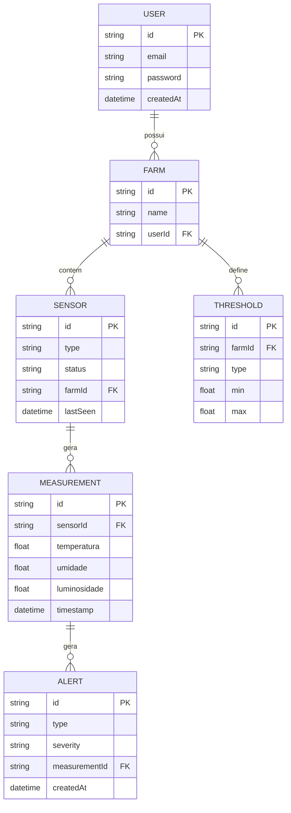

## 🏗️ 1. Arquitetura do Sistema (Estrutura Monorepo)

O projeto utiliza arquitetura de Monorepo.

- **`apps/api`**: Backend (NestJS 10)
- **`apps/web`**: Frontend (ReactJS 19)
- **`apps/extension`**: Vanilla TypeScript para manipulação de DOM.

---

## 2. Orquestração e Ecossistema de Contexto (MCP)

**GitHub Projects MCP:** Utilize para sincronizar o status das User Stories (PRD) com o desenvolvimento técnico. As definições de "Done" devem seguir os Critérios de Aceitação das Issues.

- **Neon.tech MCP:** Interface obrigatória para introspecção e migração do banco de dados PostgreSQL. O esquema gerado pelo Prisma deve ser validado contra o estado real do banco via este MCP.
- **Prisma MCP:** Sincronização entre schema e banco real
- **Stitch MCP (Google):** Utilizado para a geração e prototipação de interfaces Angular. Consulte este contexto para garantir que os componentes sigam os padrões visuais e funcionais definidos no Stitch.

---

## 3. Stack Tecnológica e Bibliotecas

### Core & Infraestrutura

- Node.js v20.x LTS
- PostgreSQL 16
- NestJS v10.x
- ReactJS (Vite ou Next opcional)
- Prisma ORM v5.x
- Jest + Supertest

---

### Bibliotecas Permitidas

- **WebSockets:** Socket.io v4.x (integrado via `@nestjs/platform-socket.io` v10.x).
- **Auth:** JWT (`@nestjs/jwt`)
- **Validação:** `class-validator` + `class-transformer`
- **Docs:** `@nestjs/swagger`
- **Tempo:** `date-fns`
- **HTTP:** Axios (frontend)

---

## 4. Arquitetura de Dados

### 4.1 Glossário Técnico

| Termo PRD | Entidade Técnica | Atributos                                                   |
| --------- | ---------------- | ----------------------------------------------------------- |
| Usuário   | `User`           | id, email, password                                         |
| Lavoura   | `Farm`           | id, name, userId                                            |
| Sensor    | `Sensor`         | id, type, status, farmId                                    |
| Medição   | `Measurement`    | id, sensorId, temperatura, umidade, luminosidade, timestamp |
| Alerta    | `Alert`          | id, type, severity, measurementId                           |
| Parâmetro | `Threshold`      | id, farmId, min, max, type                                  |

---

### 4.2 Modelagem de Dados (Mermaid)



---

## 5. Contratos Globais (DTOs & Interfaces)

> Tipagem TypeScript para validação de entrada (Request) e saída (Response).

- **LoginDTO:** `{ email: string, password: string }` → Retorna Token JWT + dados do usuário.
- **CreateFarmDTO:** `{ name: string }` → Cria nova lavoura vinculada ao usuário autenticado.
- **CreateSensorDTO:** `{ type: string, farmId: string }` → Registra um sensor em uma lavoura.
- **CreateMeasurementDTO:** `{ sensorId: string, temperatura?: float, umidade?: float, luminosidade?: float, timestamp: datetime }` → Registra uma medição. Timestamp obrigatório (RN05).
- **CreateThresholdDTO:** `{ farmId: string, type: string, min: float, max: float }` → Define limites de alerta por lavoura e tipo de variável (RN06).
- **AlertResponseDTO:** `{ id: string, type: string, severity: string, measurementId: string, createdAt: datetime }` → Estrutura de retorno de alertas.

---

## 6. Scaffolding Macro (Arquitetura Backend)

### 6.1. Estrutura de Diretórios (Padrão Oficial NestJS CLI)

> Organize a pasta `apps/api/src` utilizando estritamente a arquitetura padrão gerada pelo NestJS CLI (Flat Structure). Cada domínio de negócio deve ser uma pasta direta na raiz do `src/`.

- **`src/auth/`**: Autenticação via email/senha e Google OAuth2. Geração e validação de JWT.
- **`src/farms/`**: CRUD de lavouras. Vinculação ao usuário autenticado.
- **`src/sensors/`**: CRUD de sensores. Controle de status (ativo/inativo) e `lastSeen`.
- **`src/measurements/`**: Ingestão de medições dos sensores. Filtragem por lavoura, sensor e período.
- **`src/alerts/`**: Geração automática de alertas com base nos `Thresholds`. Classificação por severidade (NORMAL, MODERADO, CRÍTICO).
- **`src/thresholds/`**: Configuração de limites de alerta por lavoura e tipo de variável.
- **`src/events/`**: `EventsGateway` (WebSocket via Socket.io) para emissão de medições e alertas em tempo real.
- **`src/common/`**: Código compartilhado globalmente (Guards de JWT, Exception Filter global, Decorators customizados).
- **`src/prisma/`**: Módulo global contendo o `PrismaService` para injeção de dependência do banco de dados.

### 6.2. Core Services (Singleton)

| Service               | Responsabilidade Macro                                                                                                                                                                                                                                               |
| :-------------------- | :------------------------------------------------------------------------------------------------------------------------------------------------------------------------------------------------------------------------------------------------------------------- |
| `PrismaService`       | Gerenciar conexão e pooling com o banco PostgreSQL (Neon.tech).                                                                                                                                                                                                      |
| `AuthService`         | Validar credenciais (email/senha ou Google) e emitir Tokens de Acesso JWT.                                                                                                                                                                                           |
| `AlertService`        | Comparar medições recebidas com os `Thresholds` configurados e gerar alertas automaticamente.                                                                                                                                                                        |
| `SensorStatusService` | Job `@Cron` que verifica periodicamente o `lastSeen` dos sensores. Quando o intervalo definido em `SENSOR_INACTIVITY_MINUTES` é ultrapassado, atualiza `status` para `inativo` e aciona o `AlertService` para gerar um alerta do tipo `sensor_offline` (US03, RN08). |

---

## 7. Segurança (API Protection)

- **ValidationPipe:** Configurado com `whitelist: true` para ignorar campos não mapeados nos DTOs.
- **JWT Expiry:** Tokens de usuário com expiração configurável via `JWT_EXPIRES_IN`.
- **CORS:** Restrito ao domínio do Frontend.
- **Ownership Guard:** Todas as rotas de lavoura, sensor e alerta devem verificar se o recurso pertence ao usuário autenticado antes de retornar dados (RN01, RN02).
- **Tratamento de Erros (Exception Filter):** Implementar um `GlobalExceptionFilter`. Toda falha deve retornar ao frontend neste exato formato JSON:
  ```json
  {
    "statusCode": 400,
    "timestamp": "2026-04-05T10:00:00.000Z",
    "path": "/api/rota",
    "message": "Descrição detalhada do erro ou array de validações"
  }
  ```

---

## 8. Contratos de API (Especificação OpenAPI)

> Implemente os Controllers e DTOs seguindo rigorosamente estas definições.

### Módulo de Autenticação

- **POST** `/auth/login`
  - **Payload:** `{ "email": "string", "password": "string" }`
  - **Regra:** Validar credenciais. Retornar `401` para credenciais inválidas (US01).
  - **Retorno:** `{ "accessToken": "string", "user": { "id", "email" } }`

- **POST** `/auth/google`
  - **Payload:** `{ "idToken": "string" }`
  - **Regra:** Validar token Google OAuth2. Criar usuário caso não exista (US01).
  - **Retorno:** `{ "accessToken": "string", "user": { "id", "email" } }`

---

### Módulo de Lavouras

- **GET** `/farms`
  - **Regra:** Retorna apenas lavouras do usuário autenticado (RN02).
  - **Retorno:** `[{ "id", "name", "sensorsCount" }]`

- **POST** `/farms`
  - **Payload:** `{ "name": "string" }`
  - **Retorno:** `{ "id", "name", "userId", "createdAt" }`

---

### Módulo de Sensores

- **GET** `/farms/:farmId/sensors`
  - **Regra:** Lista sensores de uma lavoura com status atualizado (RN03, US03).
  - **Retorno:** `[{ "id", "type", "status", "lastSeen" }]`

- **POST** `/farms/:farmId/sensors`
  - **Payload:** `{ "type": "string" }`
  - **Retorno:** `{ "id", "type", "status", "farmId" }`

---

### Módulo de Medições

- **POST** `/measurements`
  - **Payload:** `{ "sensorId": "string", "temperatura": float, "umidade": float, "luminosidade": float, "timestamp": "datetime" }`
  - **Regra:** Timestamp obrigatório (RN05). Após persistir, acionar `AlertService` para verificar limites configurados (RN07). Emitir evento WebSocket com a nova medição (US02).
  - **Retorno:** `{ "id", "sensorId", "timestamp" }`

- **GET** `/measurements`
  - **Query Params:** `farmId`, `sensorId` (opcional), `from` (data inicial), `to` (data final)
  - **Regra:** Filtrar medições por lavoura, sensor e período (US02, US05).
  - **Retorno:** `[{ "id", "sensorId", "temperatura", "umidade", "luminosidade", "timestamp" }]`

---

### Módulo de Alertas

- **GET** `/alerts`
  - **Query Params:** `farmId`, `severity` (opcional: `NORMAL | MODERADO | CRITICO`), `type` (opcional: `threshold_exceeded | sensor_offline`)
  - **Regra:** Retorna alertas das lavouras do usuário autenticado, filtráveis por severidade e tipo (US03, US06, RN09).
  - **Retorno:** `[{ "id", "type", "severity", "measurementId", "sensorId", "createdAt" }]`

> **Job de inatividade (US03 — RN08):** O `SensorStatusService` executa periodicamente via `@Cron`, configurado pelo valor de `SENSOR_INACTIVITY_MINUTES` (`.env`). Para cada sensor cuja `lastSeen` ultrapassar o intervalo definido, o serviço atualiza `status` para `inativo` e gera um alerta do tipo `sensor_offline` com severidade `MODERADO`. Esse alerta é retornável pela rota acima usando `?type=sensor_offline`.

---

### ⚙️ Módulo de Thresholds

- **POST** `/thresholds`
  - **Payload:** `{ "farmId": "string", "type": "string", "min": float, "max": float }`
  - **Regra:** Limites configurados por lavoura e por tipo de variável (RN06).
  - **Retorno:** `{ "id", "farmId", "type", "min", "max" }`

- **GET** `/farms/:farmId/thresholds`
  - **Retorno:** `[{ "id", "type", "min", "max" }]`

---

## 9. Contrato de Configuração (Environment)

> Nenhum dado sensível ou configurável deve estar _hardcoded_. Utilize o `@nestjs/config` (`ConfigModule`) para carregar e validar as variáveis em tempo de inicialização.

As seguintes variáveis são o contrato obrigatório para o arquivo `.env`:

- `DATABASE_URL` — String de conexão do PostgreSQL (Neon.tech).
- `JWT_SECRET` — Chave para assinar o token de sessão do usuário.
- `JWT_EXPIRES_IN` — Tempo de expiração da sessão (ex: `8h`).
- `GOOGLE_CLIENT_ID` — ID do Client OAuth2 para validação do login social (US01).
- `SENSOR_INACTIVITY_MINUTES` — Intervalo em minutos para considerar um sensor inativo (RN08).

## 10.  Design Tokens

Design system da aplicação

#### Cores

- **Primary:** #1D9E75
- **Secondary:** #D85A30
- **Tertiary:** #BA7517
- **Neutral:** #727974

#### Fonte

- **Google Fonts:** Manrope